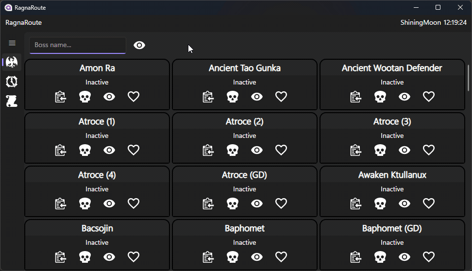

RagnaRoute is a Ragnarok Online boss spawn and quest tracker.

Open sourced for demonstration only. This project will not be maintained or improved.

## Features

Copy warp commands for fast in-game movement.

Sorts objectives by completion status, time until respawn, and favoriting.

Filters objectives through hiding and text input.

Tracks history of completions through a local Sqlite db.

## Background

This was built for a specific RO server several years back. Configuration files could be changed to represent a different server.

Support for instanced dungeons was planned, but never implemented. Same with support to show boss HP and elemental weaknesses.

This cannot be repurposed for other games without some rewriting.
